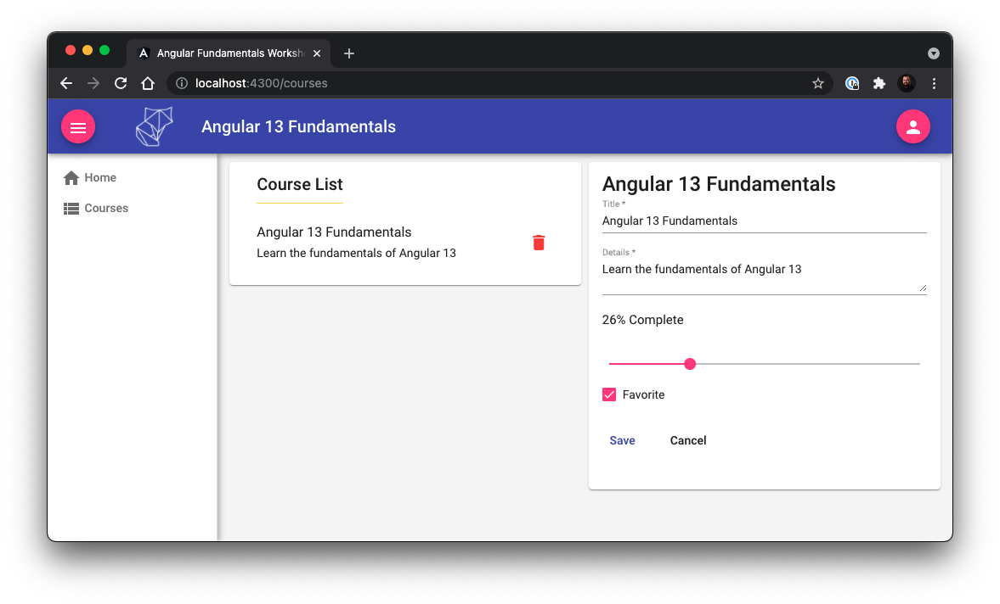

# Angular 13 Fundamentals Workshop



This is the sample project for the Angular 13 Fundamentals Workshop.

This sample project includes an Angular web application generated with [Angular CLI](https://github.com/angular/angular-cli) version 13.0.3. It also contains a mock RESTful API using `json-server`.

## Prerequisites
- [Git](https://git-scm.com/book/en/v2/Getting-Started-Installing-Git)
- Node.js and NPM – we recommend using [NVM (Linux/Mac)](https://github.com/creationix/nvm) or [NVM-Windows (Windows)](https://github.com/coreybutler/nvm-windows)
- Install Angular CLI via `npm i -g @angular/cli`

## Web: Getting Started

```
git clone https://github.com/onehungrymind/angular13-fundamentals-workshop
cd angular13-fundamentals-workshop
npm i
npm start
```

The `npm start` calls the `serve:all` command which is a convenience method that runs the `serve:api` and `serve:web` commands concurrently. You can run each command separately if you need to.

```
"start": "npm run serve:all",
"serve:web": "ng serve --port 4300 --open",
"serve:api": "json-server server/db.json",
"serve:all": "concurrently \"npm run serve:api\" \"npm run serve:web\"",
```

The web application will open to [http://localhost:4200](http://localhost:4200) in your browser.

You can see the API by navigating to [http://localhost:3000/](http://localhost:3000/) in your browser.

> Note: the above terminal commands are for Mac. Remember to substitute the appropriate commands for your OS.

## Development server

Run `ng serve` for a dev server. Navigate to `http://localhost:4200/`. The app will automatically reload if you change any of the source files.

## Code scaffolding

Run `ng generate component component-name` to generate a new component. You can also use `ng generate directive|pipe|service|class|guard|interface|enum|module`.

## Build

Run `ng build` to build the project. The build artifacts will be stored in the `dist/` directory.

## Running unit tests

Run `ng test` to execute the unit tests via [Karma](https://karma-runner.github.io).

## Running end-to-end tests

Run `ng e2e` to execute the end-to-end tests via a platform of your choice. To use this command, you need to first add a package that implements end-to-end testing capabilities.

## Further help

To get more help on the Angular CLI use `ng help` or go check out the [Angular CLI Overview and Command Reference](https://angular.io/cli) page.
